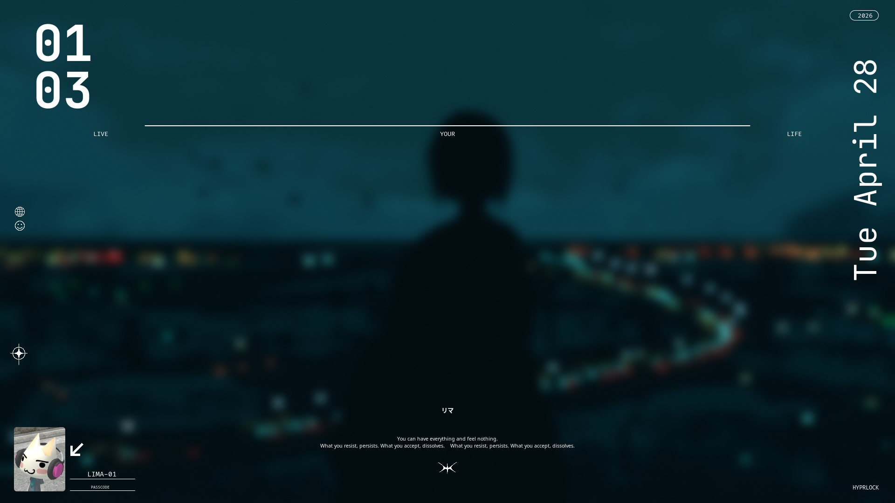
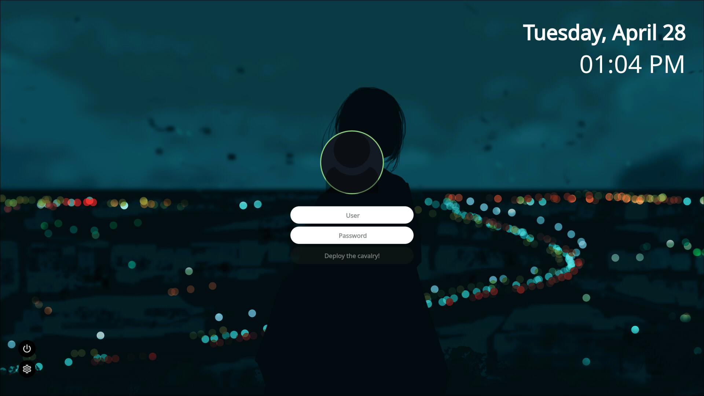
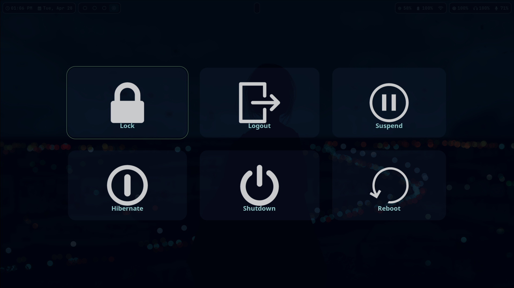
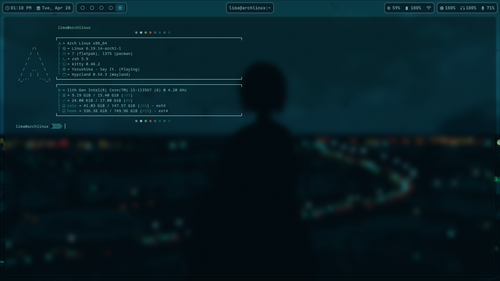

# My Dotfiles

Configurações personalizadas para **Linux** focadas em produtividade e no ambiente do sistema operacional, utilizando **Hyprland** como gerenciador de janelas.

## 🛠️ O que tem aqui?
* **WM:** [Hyprland](https://hyprland.org/) (Wayland)
* **Shell:** ZSH (configurações no `.zshrc`)
* **Terminal:** Kitty / Alacrityy
* **Barra desktop:** Waybar
* **Scripts do SO como:** Aviso de bateria, Aviso de conexão a internet, troca de temas (`mudar_tema.sh`) do ambiente completo usando [Pywal](https://github.com/dylanaraps/pywal) anexado ao hyprlock, hyprpaper, waybar, rofi

## 📂 Estrutura do Repositório
* `.config/hypr`: Toda a lógica do Hyprland e atalhos de teclado.
* `.config/hypr/scripts`: Scripts customizados para notificações de sistema.
* `.zshrc`: Plugins e aliases para o terminal.
* `mudar_tema.sh`: Script para troca dinâmica de cores (Pywal/Geral).

> **Aviso:** Não execute scripts de dotfiles de terceiros sem antes entender o que eles fazem ou se seus caminhos estão corretos, muitos script usam @import e se comunicam usando caminhos de path.

**Screenshots:**

**Swaync**

**Rofi**

**Hyprlock**

**SDDM**

**Wlogout**

**Kitty**

